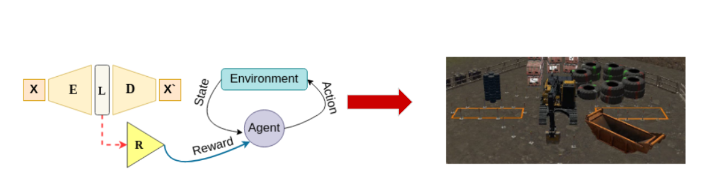

# Learning Reward Functions using Expert Demonstrations for Crane Automation

  

Official code repository for the paper 
***Learning Reward Functions using Expert Demonstrations for Crane Automation*** by [Pranav Agarwal](https://pranaval.github.io/).

# Installation
## Simulator
* We use [Vortex Studio 2021a](https://vortexstudio.atlassian.net/wiki/spaces/VSD21A/overview) for collecting the dataset and further training the reinforcement learning policy. 
* All files for installing the simulator is availaible [here](https://drive.google.com/drive/folders/1nCHXmvMzyiH3GqQtNNYV-WuR99p5xqDD). 
* The installation involves downloading all the files and running the **.exe** file, further selcting all the files when prompted.
 * The simulator requires a license which can be requested from [CMLabs](https://www.cm-labs.com/vortex-studio/software/vortex-studio-academic-access/) using their academic access program.

