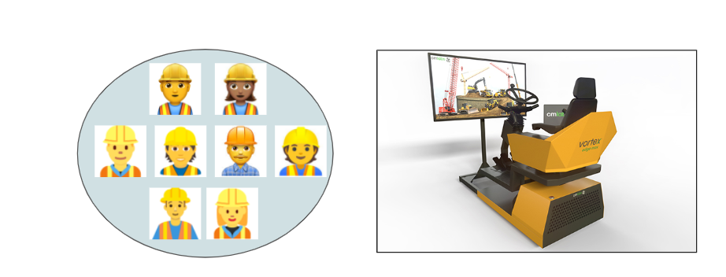
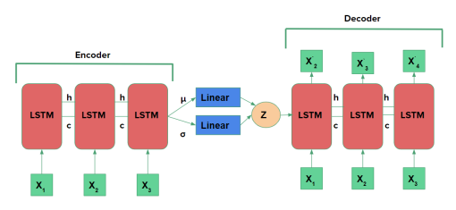
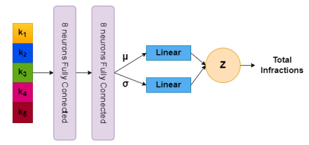
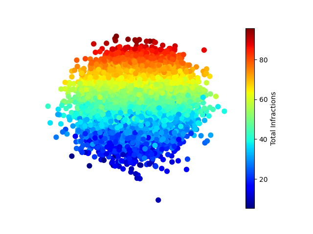

# Automatic Evaluation of Excavator Operators using Learned Reward Functions

<p align="center">
  
</p>

Official code repository for the paper 
***Automatic Evaluation of Excavator Operators using Learned Reward Functions*** by  
[Pranav Agarwal](https://pranaval.github.io/), [Marek Teichmann](https://ca.linkedin.com/in/marekteichmann), [Sheldon Andrews](https://profs.etsmtl.ca/sandrews/) and [Samira Ebrahimi Kahou](https://saebrahimi.github.io/).

# Installation
## Simulator
* We use [Vortex Studio 2021a](https://vortexstudio.atlassian.net/wiki/spaces/VSD21A/overview) for collecting the dataset and further training the reinforcement learning policy.  
* The installation involves downloading all the files and running the **.exe** file, further selcting all the files when prompted.
 * The simulator requires a license which can be requested from [CMLabs](https://www.cm-labs.com/vortex-studio/software/vortex-studio-academic-access/) using their academic access program.

## Code
* Install [Anaconda](https://www.anaconda.com/products/distribution#Downloads).
* This repository is required to be cloned, further creating the conda environment.
```
git clone https://github.com/pranavAL/InvRL_Auto-Evaluate
cd InvRL_Auto-Evaluate
conda env create -f environment.yml
conda activate myenv
```
⚠️**WARNING**⚠️ 

All code should run within the specified virtual environment as created above, considering the strict requirements of Vortex. No further packages are required to be installed.
* This work use wandb for real time logging of metrics, please register for the account and use the given command to login.
```
wandb login
```

## System Requirements
* OS - Windows 10
* GPU - NVIDIA GeForce GTX 1050 Ti
* NVIDIA Driver - 457.49
* CUDA Version - 11.1

🔴**IMPORTANT**🔴

These are strict requirements. Vortex tools used in this work is not supported on Linux and its graphics for this paper is currently tested only on the above configurations.

# Post-Installation
The default scenes and mechanism of the crane are manipulated to match the requirement of this work. Please run the below code to change default configurations.
```
copy scenes\*.vxscene "C:\CM Labs\Vortex Construction Assets 21.1\assets\Excavator\Scenes\ArcSwipe"
copy scenes\*.vxmechanism  "C:\CM Labs\Vortex Construction Assets 21.1\assets\Excavator\Mechanisms\Excavator"
```

# Dataset Collection and Analysis
<p align="center">
  
</p>

* The dataset of different experts are collected using Vortex Advantage simulator systems which features enclosed computers running Vortex software.
* To extract features into human readable format from the original raw dataset run
```
python ExtractFeatures.py
```
* For further analysis, feature engineering and extracting the final dataset divided into train, test and validation set use
```
python EDA.py
```
* To get a preview of the above code, for visual analysis of the dataset explore the jupyter notebook `ExtractFeatures.ipynb` and `EDA.ipynb`

# Distribution Learning
### Dynamics Distribution
```
python model_dynamics.py
```
<p align="center">
  
</p>

### Safety Distribution
```
python model_infractions.py
```
<p align="center">
  
</p>

# Inference
To check the reconstruction of the future states given the dynamics
```
python infer.py
```
To show visualisation of the distribution of infractions
```
python inference.py
```
<p align="center">
  
</p>

# Policy Learning

### Training
```
cd ExcavatorRLEnv
python train.py --complexity 0 --test_id "Reward Type" & python agent.py --complexity 0 --test_id "Reward Type"
```
Please specify the reward type that is: "Task", "Dynamic", "DynamicSafety".

🔴**IMPORTANT**🔴
* In an ideal case a single process should both interact with the simulator as well as update the policy. 
* In our case, the interaction with the environment as well as policy update is done with two different processes.
* Since, Vortex use GIL lock and Pytorch need GIL for backpropagation.
* To avoid this conflict run two different process as shown above.

### Testing
```
python test.py --complexity 0 --test_id "Reward Type"
```

🔴**Note**🔴
* We do not release a single test code for running the complete project.
* This is because of the need to train multiple independent modules.
* Instead the above codes should be run sequentially to get the results as presented.

